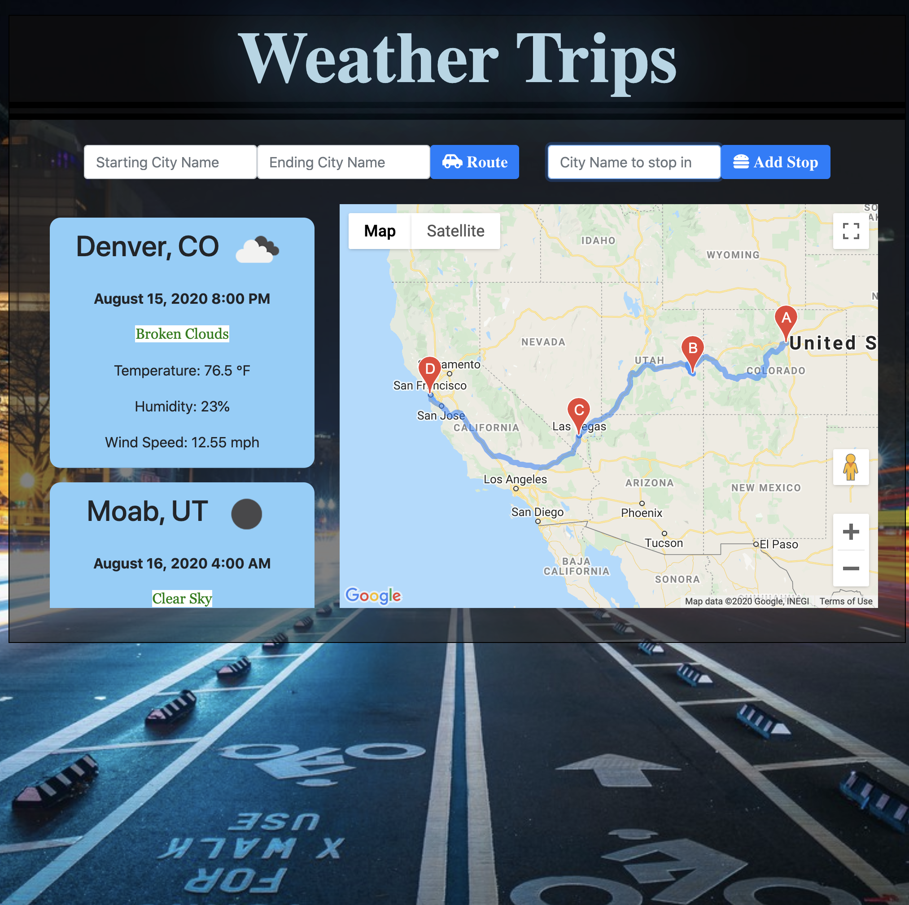

# Weather Trips
By Jason Tilley, Mason McGinley, Haley Lewis, & Christal Vigil

## Tech used:
HTML, CSS, Javascript, jQuery, Ajax, Google Maps Javascript API, Google Directions API, Open Weather API, Moment.js, Bootstrap

## Links:
 Git Hub:
 https://github.com/jttilley/Weather-Trips
 
 Deployed link:
 https://jttilley.github.io/Weather-Trips/index.html

## Objective:
- to make an app using 2 external APIs and 1 3rd party API
- We decided to make an app that would route a road trip for you using google maps and tell you the weather for when you would arrive at your stops if you left now. This would allow you to plan your stops according to the weather or to prepare yourself for the weather along your road trip. 

## How it works:
 - The user will enter a starting city and ending city in the specified input boxes.
 - When they click the Route button:
    - if a start city is missing or an end city is missing an alert will pop up reminding the user to enter that city too.
    - A map is populated with the route for the trip
    - Weather cards are created in trip order with the weather for the specified cities at the aproxamate time you would be there if you left right now.
    - The route is saved in local storage so it will load back up when you come back to the app.
- The user can add stop cities along the way by entering them in order in the input for cities to stop in.
- When they click the Add Stop button:
    - If the input is left blank an alert will pop up reminding the user to enter a stop city first.
    - The route is updated to include the stop city
    - A new card for that city is inserted with weather for when you would arrive at that stop. 
    - An hour is assumed for every stop. so that gets added to the times for when you would arrive at the next stop.
- All the citys entered can be changed by dragging them to another city.
- The route taken can also be dragged and the new travel times are incorporated into calculating the times for the weather.
- If you enter a new start and end city and press route it will delete the previous route and start again fresh with a new route.

## Current Limitations:
- If the travel time takes more than 48 hours the weather is not calculated
- If a stop is dragged to a small city or landmark the weather may not be calculated for that stop and it may cause an error for future stops until that city is adjusted to a working city.

## License:
*MIT* © 2020 Jason Tilley, Mason McGinley, Haley Lewis, & Christal Vigil